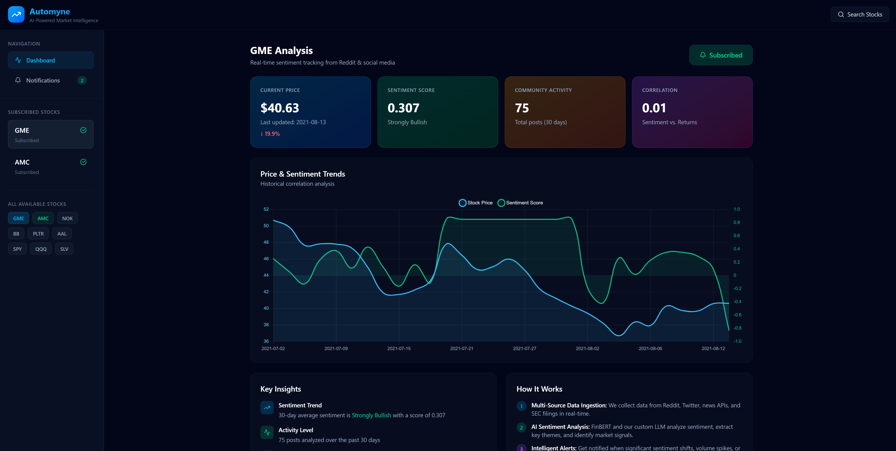
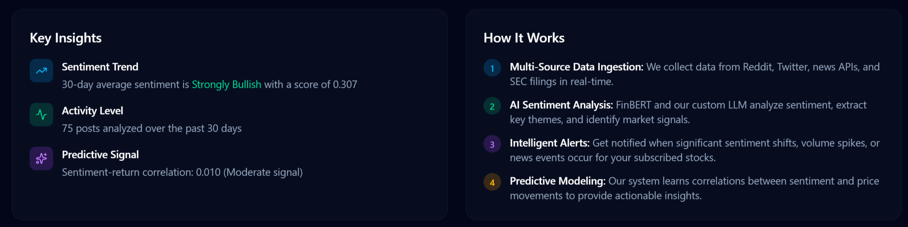
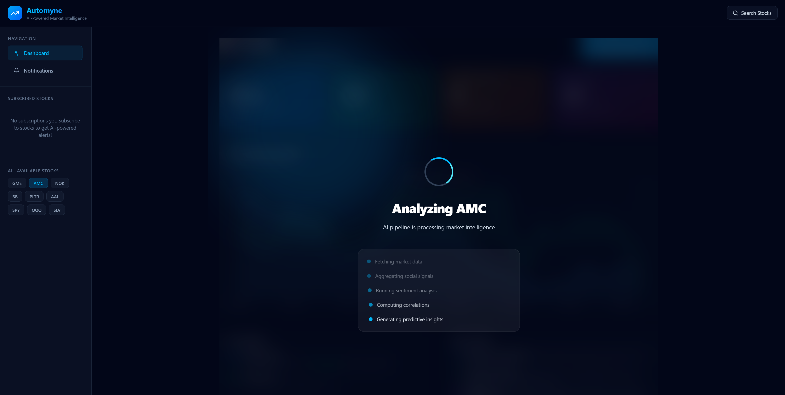
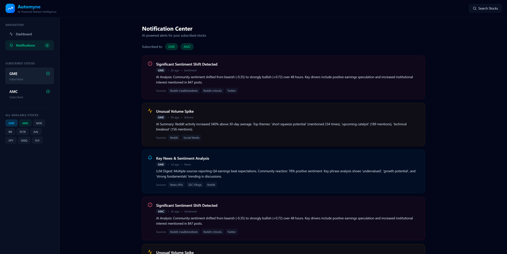

# 🚀 Automyne

### AI Powered Market Sentiment Intelligence Platform

Automyne is an AI-powered stock sentiment analysis platform that combines financial market data with social sentiment signals to generate intelligent trading insights and visual analytics dashboards.

The platform processes Reddit/social sentiment, market price movements, and AI-driven sentiment analysis to generate bullish, bearish, and neutral trading signals in real time.

---

# ✨ Highlights

- Transformer-based sentiment analysis using RoBERTa
- FastAPI backend with AI inference pipeline
- Interactive React dashboard with caching & animations
- Composite trading signal generation engine
- Real-time market sentiment visualization
- Modern responsive UI with animated transitions

---

# 🛠️ Tech Stack

## Frontend
- React
- Vite
- Tailwind CSS
- Framer Motion
- Chart.js
- Axios

## Backend
- FastAPI
- Pandas
- NumPy
- Scikit-learn
- Transformers
- PyTorch
- yFinance

---

# 🚀 Installation

## Backend Setup

```bash
cd backend

pip install -r requirements.txt

uvicorn api:app --reload
```

Backend runs on:

```text
http://localhost:8000
```

---

## Frontend Setup

```bash
cd frontend

npm install

npm run dev
```

Frontend runs on:

```text
http://localhost:5173
```

---

# 🌐 API Endpoint

## Run Pipeline

```http
POST /run-pipeline
```

### Request Body

```json
{
  "ticker": "GME"
}
```

---

# 📸 Screenshots

### Main Dashboard



### AI Insights



### Loading State



### Notification For Subscribed Tickers (Concept)



---

# 👨‍💻 Author

## Mayank Rajguru

Aspiring AI/ML Engineer & Full Stack Developer building AI-powered analytics and productivity systems.